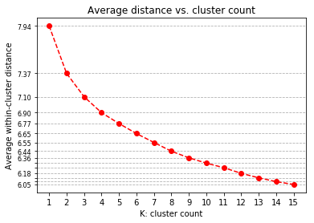

# Identify Customers Segments for Marketing Campaigns

## Applying unsupervised learning techniques in [`scikit-learn`](https://scikit-learn.org/stable/)
<br />

> Example screen:

<p align="center">
  
</p>

This project is part of a [Udacity](https://www.udacity.com/) program: [Data Science degree, Project 3](https://github.com/udacity/DSND_Term1).

The objective of the project is to apply unsupervised learning techniques to identify segments of the population that form the core customer base for a mail-order sales company in Germany. These segments can then be used to deploy direct marketing campaigns towards audiences that will have the highest expected rate of return. The data was provided by Udacity's partners at Bertelsmann [Arvato Analytics](https://www.arvato.com/in-en/about.html).

Main files in the repository:

- `Identify_Customer_Segments.ipynb`: Jupyter notebook including main Python code.


## Business motivation

Identify segments of the population, based on historical customer data, that form the core customer base for a mail-order sales company in Germany. These segments can then be used to deploy direct marketing campaigns towards specific audiences in the general population which will have the highest expected rate of return.


## Data Science motivation

Apply unsupervised learning tools included in [`scikit-learn`](https://scikit-learn.org/stable/) for dimensionality reduction and clustering:
- [Principal component analysis (PCA)](https://scikit-learn.org/stable/modules/decomposition.html#decompositions)
- [K-means](https://scikit-learn.org/stable/modules/clustering.html#k-means)


## Use Jupyter Notebook

The Jupyter Project highly recommends new users to install [Anaconda](https://www.anaconda.com/distribution/); since it conveniently installs Python, the Jupyter Notebook, and other commonly used packages for scientific computing and data science.

Use the following installation steps:

1. Download Anaconda.

2. Install the version of Anaconda which you downloaded, following the instructions on the download page.

3. To run the notebook:

```bash
jupyter notebook Identify_Customer_Segments.ipynb
```


## Python version

3.7.1 (default, Oct 23 2018, 14:07:42) 


## Python libraries

The Jupyter Notebook and the Python modules require the following Python libraries:

- collections
- matplotlib
- numpy
- pandas
- seaborn
- sklearn


## Acknowledgments

- [Udacity: Data Scientist Nanodegree program](https://www.udacity.com/course/data-scientist-nanodegree--nd025)
- Bertelsmann [Arvato Analytics](https://www.arvato.com/in-en/about.html): datasets
- Jupyter Documentation: [Installing Jupyter Notebook](https://jupyter.readthedocs.io/en/latest/install.html)


## Author

Juan Carlos Lopez

- jc.lopezh@gmail.com
- [GitHub](https://github.com/jclh/)
- [LinkedIn](https://www.linkedin.com/in/jclopezh/)


## Contributing

1. Fork it (https://github.com/jclh/customers-PCA-clustering/fork)
2. Create your feature branch (git checkout -b feature/fooBar)
3. Commit your changes (git commit -am 'Add some fooBar')
4. Push to the branch (git push origin feature/fooBar)
5. Create a new Pull Request


